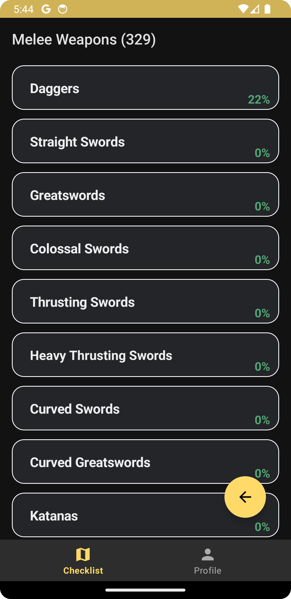
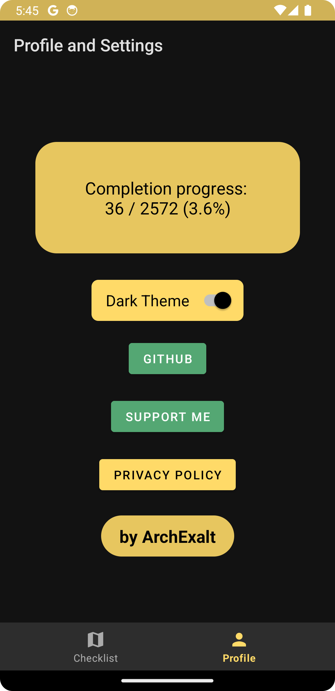

# Elden Ring Checklist

| [Download Elden Ring Checklist v1.0](https://github.com/ArchExalt/EldenRingChecklist/releases/tag/stable) | [Privacy Policy](https://archexalt.github.io/EldenRingChecklist/) |
| --- | --- |

SHA-256: 018e180cfe1635159e011f51c279dc440e8db426da585a14e7f5adc34b8a1df1

Update v1.0 (21.07.24):

- initial release.

---

This Android app was created in order to bring the ease of use in form of a minimalistic checklist for Elden Ring players. Updated to version 1.12.3.

Functionality:
- check off obtained items, finished quests, completed achievements and more for both Elden Ring and Shadow of the Erdtree;
- easily navigate through the list of items in alphabetical order;
- monitor your completion progress;
- switch between light/dark theme;
- use the app in offline mode, no Internet connection required.

If you have any questions, would like to contribute to the app, or want to report a bug, feel free to open an issue on GitHub or contact me via email.

Special thanks to kgnokt for saving me some time editing the texts.

If you would like to support me:

---

   
